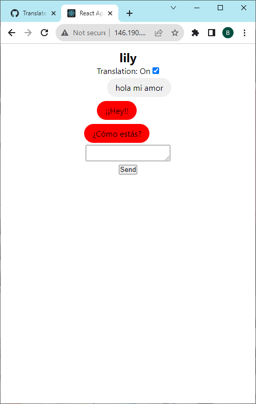
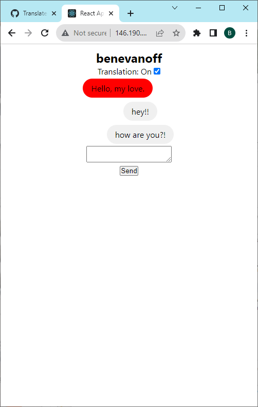
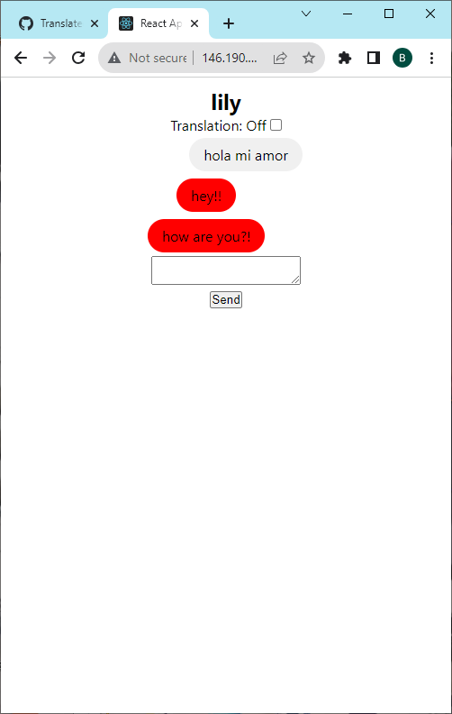
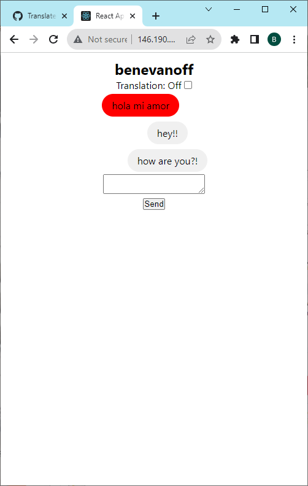
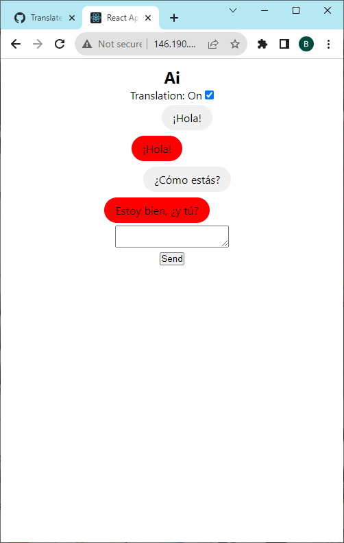
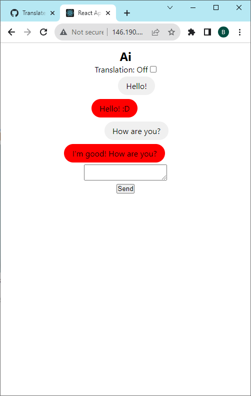

# Translated Chat

This is a simple web-based messaging app with modern Ai technologies built in to facilitate multilingual communication and language learning. Specifically, it features a toggle for automatic translation and a chatbot that can be used for practicing a language you are learning.

Translations are powered by pretrained Seq-to-Seq models from [The Tatoeba Translation Challenge](https://github.com/Helsinki-NLP/Tatoeba-Challenge/tree/master) and the chatbot is powered by [DialoGPT](https://github.com/microsoft/DialoGPT), both of which are run locally. This app therefore requires a minimum of 3GB free disk storage and 4GB of RAM to run. The weights are downloaded from the HuggingFace modelhub as this app utilizes the HuggingFace transformers library.

## Deployment

The whole application is dockerized. Simply run `docker compose up --build` once Docker is running on your machine.

## Docs

Further documentation is splitup by [backend](docs/backend/README.md) and [frontend](docs/frontend/README.md).

## Licensing

This application is the intellectual propery of Benjamin Evanoff. It is provided as-is and without warranty.
## Images/Sceenshots
 

 

 