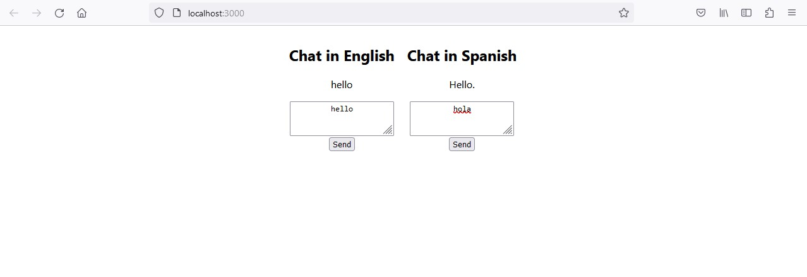

# Translated Chat

This is a very simple web app which featers a Python FastAPI backend supporting English-Spanish machine translation inference using models from [The Tatoeba Translation Challenge](https://github.com/Helsinki-NLP/Tatoeba-Challenge/tree/master) via the HuggingFace Transformers library. The web UI is incredibly simple, written with ReactJS, there are two chat boxes: one intended for English and one intended for Spanish. The text messages will appear on the screen only in English, the Spanish messages having been translated.

## Deployment

The whole application is dockerized. Simple run `docker compose up --build` once Docker is running on your machine.

## Licensing

This application is the intellectual propery of Benjamin Evanoff. It is provided as-is and without warranty.