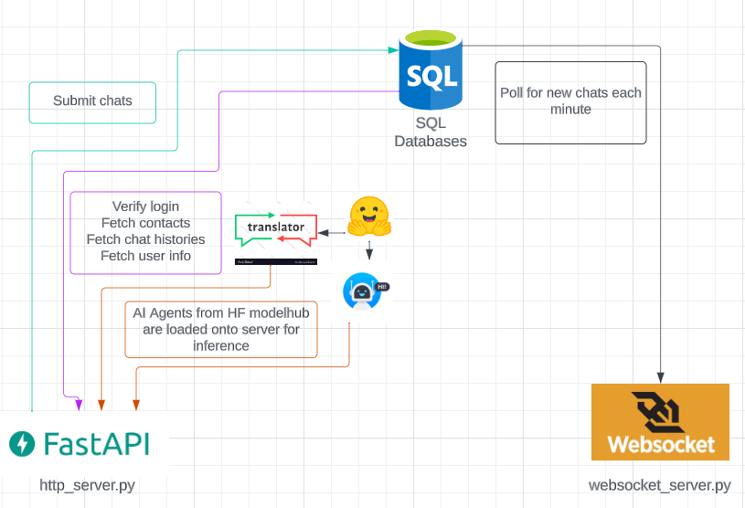

# Translated-Chat Backend

The backend for this application is split into two parts: an HTTP REST server and a websocket server.

## Deployment

### Docker

They can both be packaged into a single docker container using the provided `Dockerfile`

### Manual

To manually run this backend you will first need to install the dependencies which can be done with this command: `python -m pip install -r requirements.txt`

Then you can startup the REST server with the command: `python -m servers.uvicorn http_server:app`

Then startup the websocket server with `python servers/websocket_server.py`